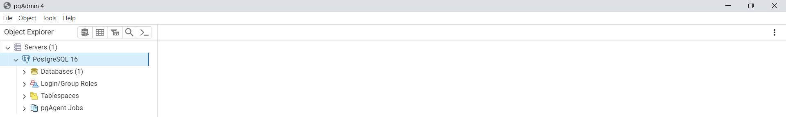

# cveditornetcore6mvcdapper

> visit my website at https://awhz.net

This project was created using visual studio 2022 and mvc 6

## Nugget Packages

here's the list of nugget package that was installed :
- dapper version 2.13.5 for orm and connectivity to postgree database
- npgsql version 8.0.3 connectivity to postgree database

## Before Run This Application

if you'r using local pc or laptop makesure when you'r running this project.
you should have installed this list of application :
- Visual Studio 2022 with mvc 6.0 package
- pgJDBC 42.7.2
- Npgsql 3.2.6
- pgAgent_PG16.4.2.2
- PostgreSQL 16
- PgBouncer 1.22.1

create the database "cveditor" using pgAdmin on postgree
step by step:
1. make sure you have installed the list of application that located on above
2. open application pgAdmin 4

3. login using your credential

4. find Node Database on you pgAdmin 4 then right click it will show context menu like image bellow

5. click "Create" on context menu and click "Database" on sub context menu like image bellow

6. click field database and fill with "cveditor" like image bellow

7. click submit button but make sure you'r fill the field database like step number 6

8. please wait several minute then the page will show cveditor on node "database"

create table "data" in database "cveditor" on postgree using pgAdmin
there are two ways
a. create using export menu
b. create using query tools
i have give the tutorial for it, you can choose what the step do you like.

a. create table "data" in database "cveditor" on postgree using pgAdmin using menu export
step by step :
1. makesure you have created the database "cveditor" and it will show on your node "database" if you'r didn't create the database make sure to follow the step create the database "cveditor" using pgAdmin
2. after you make sure the database "cveditor" has been created find and click node "cveditor"

3. find and click node "Schemas"

4. find and right click node "Public" it will show context menu like image bellow

5. find and click "Restore" on context menu

6. click icon folder on field filename and find the files name "cveditor" the path are located on the same project in folder manual book so makesure for it

7. after you find the filename "cveditor" double click it

8. please make sure your using the correct path on field filename and click button "Restore"

9. please wait several minute and the page will show alert like image bellow

10. finish

b. create table "data" in database "cveditor" on postgree using pgAdmin using query tools
step by step :
1. makesure you have created the database "cveditor" and it will show on your node "database" if you'r didn't create the database make sure to follow the step create the database "cveditor" using pgAdmin
2. after you make sure the database "cveditor" has been created find and click node "cveditor"

3. find and click node "Schemas"

4. find and right click node "Public" it will show context menu like image bellow

5. find and click "Restore" on context menu

6. click icon folder on field filename and find the files name "cveditor" the path are located on the same project in folder manual book so makesure for it

7. after you find the filename "cveditor" double click it

8. please make sure your using the correct path on field filename and click button "Restore"

9. please wait several minute and the page will show alert like image bellow

10. finish

oke here's the final step after you created the database "cveditor" and table "data" please open visual studio project and run the project.
here's the step by step
1. go to your path download of this project and find and double click the filename ""

2. find file appsconfig. the makesure the database connection like host , port , username , password , database name

3. after 

## Known Bug and how to handle it

No such host is known

for local pc makesure your instaled the required application that are listed on "Before Run This Application" section
after your makesure all the program has been instaled if your on local pc try using "localhost" but if your using outside your pc just using the ip

Failed to connect to 127.0.0.1:543

please makesure your using right port of postgree that instaled from postgree

password authentication failed for user "postgres1"

please makesure your using right credential for login into postgree

database "cveditor" does not exist

please makesure your created database "cveditor" on your postgree

relation "data" does not exist

please makesure there are table "data" on database "cveditor"

column "skills" of relation "data" does not exist

please makesure there are coloumn "id", "name", "gender", "nationality", "education", "skills", "experience" in table "data" on database "cveditor" or you can reimport the table using files name "cveditor.sql" on folder "Manual Book"