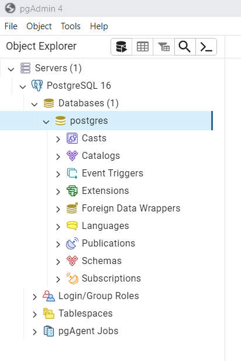
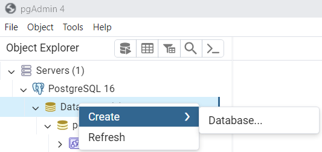
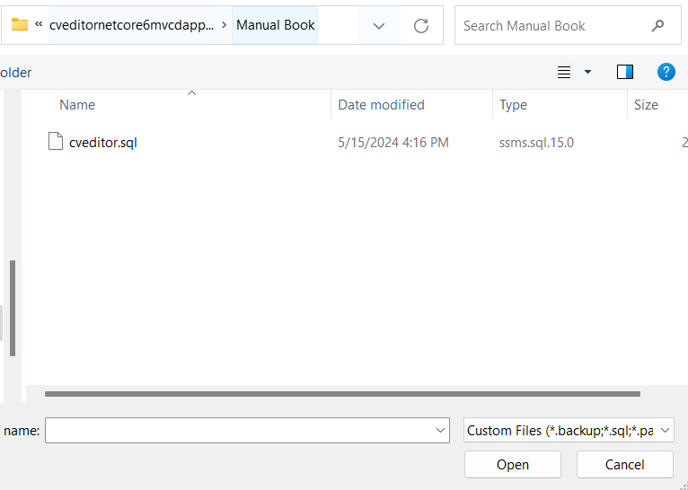
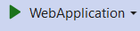

# cveditornetcore6mvcdapper

> visit my website at https://awhz.net

This project was created using visual studio 2022 and mvc 6

## Nugget Packages

here's the list of nugget package that was installed :
- dapper version 2.13.5 for orm and data mapper that will enchance the ado.net connectivity
- npgsql version 8.0.3 connectivity to postgree database

## list of required application

if you'r using local pc or laptop makesure when you'r running this project.
you should have installed this list of application :
- Visual Studio 2022 with mvc 6.0 package
- pgJDBC 42.7.2
- Npgsql 3.2.6
- pgAgent_PG16.4.2.2
- PostgreSQL 16
- PgBouncer 1.22.1

## create the database "cveditor" using pgAdmin on postgree

step by step:
1. make sure you have installed the list of application that located on section "list of required application"
2. open application pgAdmin 4 and login using your credential

3. here's the view then you'r success login using your credential on pgAdmin 4

4. find Node "Server" and click the arrow on the node in pgAdmin 4

5. find Node Database on you pgAdmin 4 then right click

6. it will show context menu like image bellow

7. find and hover "Create" on context menu and click "Database" on sub context menu like image bellow

8. it will show the dialog of create database like image bellow

9. find and click field database and fill with "cveditor" like image bellow

10. click save button but make sure you'r fill the field database like step number 6

11. please wait several minute until it show the popup information "database connected"

12. then the page will show cveditor on node "database"

## create table "data" in database "cveditor" on postgree using pgAdmin
before you create table "data" make sure your have created the database "cveditor" and it will show on your node "database" if not found you can check follow the instruction in the section "create the database "cveditor" using pgAdmin on postgree"

there are two ways
a. create using export menu
b. create using query tools
the different between the step a and b is the b already have one data in tables.
please choose what the step do you like.

## a. create table "data" in database "cveditor" on postgree using pgAdmin using menu export
before you create table "data" make sure your have created the database "cveditor" and it will show on your node "database" if not found you can check follow the instruction in the section "create the database "cveditor" using pgAdmin on postgree"

step by step :
1. find and click node "cveditor"

2. find and click node "Schemas"

3. find and right click node "Public"

3. it will show context menu like image bellow

4. find and click "Restore" on context menu

5. it will show the Restore dialog like image bellow

6. click icon folder on field filename that are located on Restore Dialog

7.  find the files name "cveditor" the path are located on the same project in folder manual book so makesure for it

8. after you find the filename "cveditor.sql" double click it

9. please make sure your using the correct path on field filename and click button "Restore"

10. please wait several minute and the page will show alert like image bellow

11. find and click the arrow on node "tables"

12. it will show the table "data" has been created

13. if you want to see the coloumn just click the node coloumn

## b. create table "data" in database "cveditor" on postgree using pgAdmin using query tools
before you create table "data" make sure your have created the database "cveditor" and it will show on your node "database" if not found you can check follow the instruction in the section "create the database "cveditor" using pgAdmin on postgree"

step by step :
1. find and right click node "cveditor"

2. it will show context menu like image bellow

3. find and click "Query Tool" on context menu

4. it will show the dialog "Query Tool"

5. find text file with name "script create public schema and create table data.txt" on folder "Manual Book" and copy the content into Field "Query" on dialog Query Tool

6. please make sure the content that are paste on field "Query" on dialog "Query Tools" are same with the files name "script create public schema and create table data.txt"

7. find and click the play button on dialog Query Tools

8. please wait several minute and check the output message on Query Tools

9. if the output message like "schema "public" already exists, skipping
ALTER TABLE" it means you'r succed for created schema and table

10. to makesure the tables are created find and click the arrow on node "Schemas"

11. find and right click the arrow on node "Public"

12. find and click the arrow on node "tables"

13. it will show the table "data" has been created

14. if you want to see the coloumn just click the node coloumn

## Run the visual studio project
oke here's the final step after you created the database "cveditor" and table "data" please open visual studio project and run the project.
here's the step by step
1. go to your path download of this project and find and double click the filename "cveditornetcore6mvcdapper.sln"

2. it will show the project are open on visual studio

3. find file with name "appsettings.json" on solution explore and double click , on image bellow i have color it with blue or cyan

4. it will show the detail of filename "appsettings.json"

5. please makesure the database connection like host , port , username , password , database name are same with your postgree on local pc

6. find and click the green play button 

7. please wait several menit until it open the default browser and will show the website completely

## Known Bug and how to handle it

## No such host is known

for local pc makesure your instaled the required application that are listed on "list of required application" section
after your makesure all the program has been instaled if your on local pc try using "localhost" but if your using outside your pc just using the ip or hostname

## Failed to connect to 127.0.0.1:543

please makesure your using right port of your instaled postgree services

## password authentication failed for user "postgres1"

please makesure your using right credential for login into postgree

## database "cveditor" does not exist

please makesure your created database "cveditor" on your postgree

## relation "data" does not exist

please makesure there are table "data" on database "cveditor"

## column "skills" of relation "data" does not exist

please makesure there are coloumn "id", "name", "gender", "nationality", "education", "skills", "experience" in table "data" on database "cveditor" or you can reimport the table using files name "cveditor.sql" on folder "Manual Book"